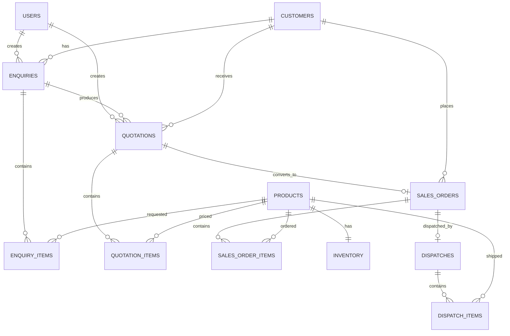

# ER Diagram

```mermaid
erDiagram
  USERS ||--o{ ENQUIRIES : creates
  USERS ||--o{ QUOTATIONS : creates
  CUSTOMERS ||--o{ ENQUIRIES : has
  ENQUIRIES ||--o{ ENQUIRY_ITEMS : contains
  PRODUCTS ||--o{ ENQUIRY_ITEMS : requested
  ENQUIRIES ||--o{ QUOTATIONS : produces
  CUSTOMERS ||--o{ QUOTATIONS : receives
  QUOTATIONS ||--o{ QUOTATION_ITEMS : contains
  PRODUCTS ||--o{ QUOTATION_ITEMS : priced
  QUOTATIONS ||--o| SALES_ORDERS : converts_to
  CUSTOMERS ||--o{ SALES_ORDERS : places
  SALES_ORDERS ||--o{ SALES_ORDER_ITEMS : contains
  PRODUCTS ||--o{ SALES_ORDER_ITEMS : ordered
  PRODUCTS ||--|| INVENTORY : has
  SALES_ORDERS ||--o| DISPATCHES : dispatched_by
  DISPATCHES ||--o{ DISPATCH_ITEMS : contains
  PRODUCTS ||--o{ DISPATCH_ITEMS : shipped
```
